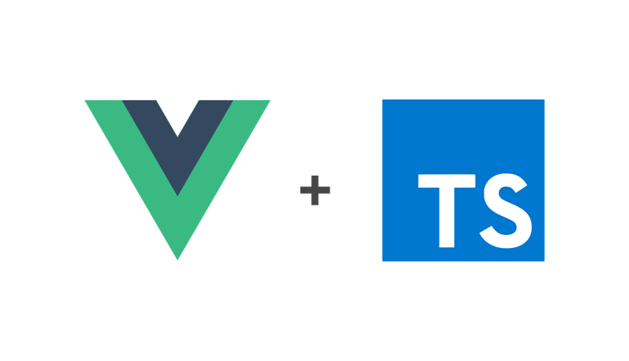

# Vue Typescript Snippets

This extension for Visual Studio Code adds snippets for Vue + Typescript workflow



## Usage
Type part of a snippet, press `Enter` or `Tab`, and the snippet unfolds.

### Snippets

#### .vue files
```
v-init       // Vue component initialization
```
#### Vuex snippets in .ts files
```
vx-init      // Vuex dynamic store bootstrapping
vx-module   // Vuex dynamic module bootstrapping
```
### 0.0.1

Initial 3 snippets
